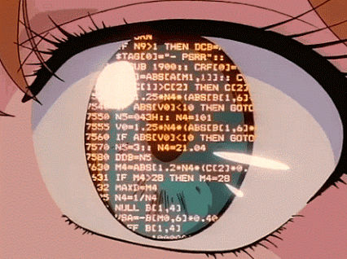

<h1 align="center">João Souza</h1>

 Olá! Meu nome é João Pedro Gonzaga dos Santos Souza, tenho 20 anos e curso Engenharia de Software na UNB (Universidade de Brasília).

 Tenho experiência na área de desenvolvimento de software, e sempre estou aberto a novas oportunidades de crescer como programador!

---

<h3 align="center">Linguagens e ferramentas</h3>

  

<h3 align="center">Me siga em outros lugares!</h3>

<b href="[meulink]" target="blank"></b> 

---
<h3 align="center">GitHub Stats</h3>

<b>
  
</b>

